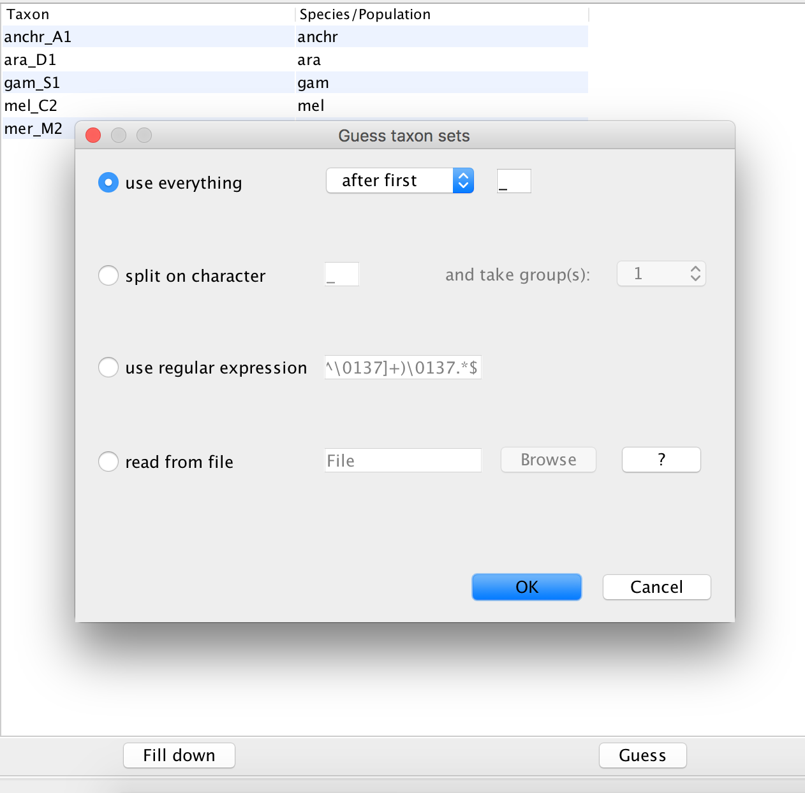
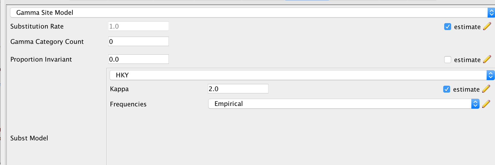
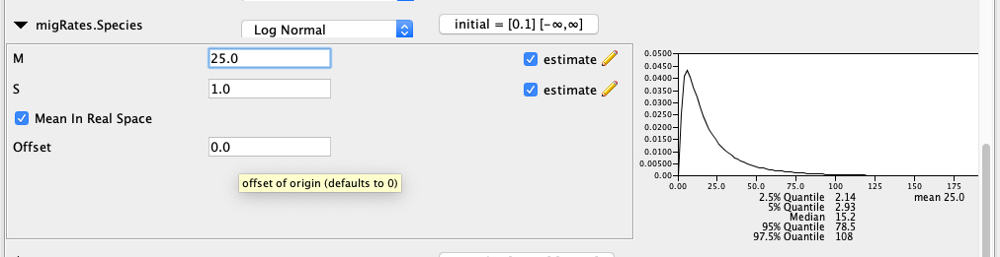
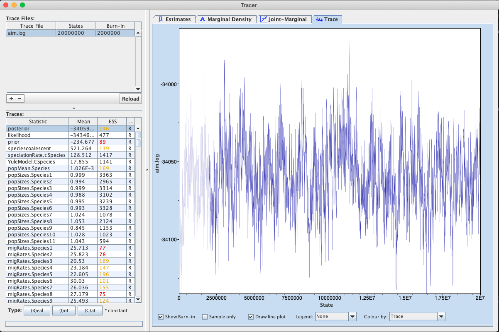

# Background


----

# Programs used in this Exercise 

### BEAST2 - Bayesian Evolutionary Analysis Sampling Trees 2

BEAST2 ([http://www.beast2.org](http://www.beast2.org)) is a free software package for Bayesian evolutionary analysis of molecular sequences using MCMC and strictly oriented toward inference using rooted, time-measured phylogenetic trees. This tutorial is written for BEAST v{{ page.beastversion }} . 


### BEAUti2 - Bayesian Evolutionary Analysis Utility

BEAUti2 is a graphical user interface tool for generating BEAST2 XML configuration files.

Both BEAST2 and BEAUti2 are Java programs, which means that the exact same code runs on all platforms. For us it simply means that the interface will be the same on all platforms. The screenshots used in this tutorial are taken on a Mac OS X computer; however, both programs will have the same layout and functionality on both Windows and Linux. BEAUti2 is provided as a part of the BEAST2 package so you do not need to install it separately.

### TreeAnnotator

TreeAnnotator is used to summarise the posterior sample of trees to produce a maximum clade credibility tree. It can also be used to summarise and visualise the posterior estimates of other tree parameters (e.g. node height).

TreeAnnotator is provided as a part of the BEAST2 package so you do not need to install it separately.


### Tracer

Tracer ([http://tree.bio.ed.ac.uk/software/tracer](http://tree.bio.ed.ac.uk/software/tracer)) is used to summarise the posterior estimates of the various parameters sampled by the Markov Chain. This program can be used for visual inspection and to assess convergence. It helps to quickly view median estimates and 95% highest posterior density intervals of the parameters, and calculates the effective sample sizes (ESS) of parameters. It can also be used to investigate potential parameter correlations. We will be using Tracer v{{ page.tracerversion }}.


### FigTree

FigTree ([http://tree.bio.ed.ac.uk/software/figtree](http://tree.bio.ed.ac.uk/software/figtree)) is a program for viewing trees and producing publication-quality figures. It can interpret the node-annotations created on the summary trees by TreeAnnotator, allowing the user to display node-based statistics (e.g. posterior probabilities). We will be using FigTree v{{ page.figtreeversion }}.

### R

We will be using [R](\href{https://www.r-project.org) to analyze and plot the output of the AIM analysis

----

# Practical: Joint inference of the species history and gene flow of 5 anopheles mosquitos by using AIM and coupled MCMC



In this tutorial, we wil infer the species history of 5 different anophoeles mosquitos species by using AIM, which is short for *Approximate Isolation with Migration*. AIM is part of the StarBeast2 package. This model can be used when we want to jointly infer the species histories for multiple loci and gene flow between extant and ancestral species 

The aim is to:

-  Learn how to jointly infer the species tree and gene flow of multiple loci from multiple species
-  Get to know how to choose the set-up of such an analysis
-  Learn how to process the output of an AIM analysis

## About the data

The data was previously used to infer the species history of the anopheles gambie comples in . It is comprised of 27 loci, each of a length of about 1000 bp, from the left arm of the 3rd chromosome. 


## Setting up an analysis in BEAUti

### Download StarBeast2 and CoupledMCMC
First, we have to download the packages StarBeast2 and CoupledMCMC by using the BEAUTi package manager. Go to _File >> Manage Packages_ and download the package and CoupledMCMC StarBeast2. 

<figure>
	<a id="fig:example1"></a>
	
	<figcaption>Figure 1: Download the StarBeast2 and CoupledMCMC packages.</figcaption>
</figure>


### Loading the template

Next, we have to load the BEAUTi template from _File_, select _Template >> AIM_.


### Loading the different loci

The sequences for the different loci can be found in the _data_ folder name can be either drag and dropped into BEAUti or imported by _Import Alignment_.  It will ask you what type the data is. If we say nucleotide, it will ask us for each loci individually. Since all loci are nucleotide data, we can choose _all are nucleotide_. To speed up the setup later, we can press _Link Site Models_ and _Link Clock Models_


### Get species corresponding to the different individuals (Taxon sets)
Next, we have to go to the Taxon sets tab.
To assign the different individuals to different species, press the _Guess_ button. Use everything before first and press the _OK_ button.

<figure>
	<a id="fig:example1"></a>
	
	<figcaption>Figure 3: Guess the species of each sampled individual.</figcaption>
</figure>

### Specify the Site Model (Site Model)

Since we Linked all the Site Models of the different loci together when loading the sequence data, we only have to set up the site models once. We will be using an HKY + $\Gamma_4$ model that allows for different relative rates of transversions and transitions, as well as for rate hetereogeneity across different sites. Additionally, we should make sure that the _estimate_ button for the substitution rates is clicked to allow for rate variation across different loci. To reduce the number of parameters we have to estimate, we can set Frequencies to Empirical. After, we can go back to the _Partitions_ field and press _Unlink Site Models_. Now each loci will have the same site model, but each with different parameters.

<figure>
	<a id="fig:example1"></a>
	
	<figcaption>Figure 4: Set the site model.</figcaption>
</figure>


### Set the clock model (Clock Model)

Since we have all sequences sampled in the present and no calibration, we have to information to estimate the clock rate. This however means that the branch lengths of our trees are in the dimension of average number substitutions and in units of time (e.g. in years). 


### Specify the priors (Priors)

The most important priors to specify here are the priors on the number of active routes of gene flow, the rates of gene flow and the effective population sizes. An active route of gene flow denotes a route of gene flow between two species that is non zero. The prior on the number of active routes (migIndicatorSum.species) of gene flow is by defaults a Poisson Prior with lambda=0.693. This puts about 50% of the probability mass on 0 active routes of gene flow. This means that in absence of information about gene flow, a prior probability on having gene flow is fairly low.

In order to speed up the setup, most of the priors are already set to what they should be, expect for the prior on the migration rates. From a hypothetical previous analysis, we know that our tree has a height of about 0.02 substitutions. If we had a migration rate of 1/0.02=50, this would mean that one lineage of a gene from present to the root is expected to migrate on average 1 time. The prior on the migration rates is set in the _migRates.Species_ block. If we set the mean of the log Normal distribution to 2.5, this assumes that we expect about 1 in every 20 lineages to have one migration event over the course of the whole species tree. This is not exactly true, but is an ok approximation for the order of magnitude of how many migration events we expect under this prior. 

<figure>
	<a id="fig:example1"></a>
	
	<figcaption>Figure 6: Setting up the prior on the migration rates.</figcaption>
</figure>

 Next, we can save the `*.xml` file under _File >> Save as_.

### Set up the xml to run two chains

In order to setup the analysis to run with coupled MCMC, we have to open the  `*.xml` and change one line in the xml.
To do so, go to the line with:
```
<run id="mcmc" spec="MCMC" chainLength="10000000" storeEvery="5000">
```
To have a run with coupled MCMC, we have to replace the above line with:
```
<run id="mcmc" spec="beast.coupledMCMC.CoupledMCMC" logHeatedChains="true" chainLength="10000000" storeEvery="5000" deltaTemperature="0.1" chains="2" resampleEvery="10000">
```
* `logHeatedChains="true"` logs the log files of the heated chains if true.
* `chainLength="100000000"` defines for how many iterations the chains is run
* `deltaTemperature="0.025"` defines the temperature difference between the chain *n* and chain *n-1*.
* `chains="2"` defines the number of parallel chains that are run. The first chain is the one that explores the posterior just like a normal MCMC chain. All other chains are what's called *heated*. This means that MCMC moves of those chains have a higher probability of being accepted. While these heated chains don't explore the posterior properly, they can be used to propose new states to the one cold chain.   

The output to the screen of a Coupled MCMC run looks slightly different then the one of a standard MCMC run.
The column called *sample* describes at which iteration of the coupled MCMC we are. The column *swapsColdChain* denotes how many times the one cold chain (the chain that runs just like a regular MCMC chain) has been swapped with another chain. The *swapProbability* denotes how likely it is that a swapping between two chains is accepted. This vaues should be somewhere between *0.2* and *0.6*. A low values indicates that the heated chains are running too hot and are not efficiently exploring the posterior. A too high values indicates that the heated chains are not running hot enough and are thus exploring parameter space that are too similar to the one of the cold chain.

```
sample    swapsColdCain    swapProbability
10000    0    0.0 --
20000    1    0.5 3m15s/Msamples
30000    1    0.3333333333333333 2m56s/Msamples
40000    1    0.25 2m34s/Msamples
50000    1    0.2 2m29s/Msamples
60000    1    0.16666666666666666 2m24s/Msamples
70000    1    0.14285714285714285 2m22s/Msamples
80000    1    0.125 2m20s/Msamples
90000    1    0.1111111111111111 2m15s/Msamples
100000    1    0.1 2m12s/Msamples
110000    1    0.09090909090909091 2m9s/Msamples
120000    1    0.08333333333333333 2m8s/Msamples
```
 


### Run the Analysis using BEAST2

Run the `*.xml` using BEAST2 or use finished runs from the *precooked-runs* folder. The analysis should take about 10 to 20 minutes. 

### Analyse the log file using Tracer

First, we can open the `aim.log` file in tracer to check if the MCMC has converged. The ESS value should be above 200 for almost all values and especially for the posterior estimates. The burnin taken by Tracer is 10%, but for this analysis 1% is enough. 

<figure>
	<a id="fig:example1"></a>
	
	<figcaption>Figure 8: Check if the posterior converged.</figcaption>
</figure>

### Analyse the species tree distribution in DensiTree

First, we can have a look at the distribution of species trees in DensiTree. To do so, open the files `species.trees` in DensiTree.

<figure>
<a id="fig:example1"></a>

<figcaption>Figure 8: Distribution of species trees inferred under AIM.</figcaption>
</figure>

We can now compare the distribution of species trees inferred under AIM to the case when we don't have any gene flow. This file can be found in the pre-cooked runs folder and is called `species_nogeneflow.trees`

<figure>
<a id="fig:example1"></a>

<figcaption>Figure 8: Distribution of species trees when not accounting for gene flow.</figcaption>
</figure>

We can see that the inferred distribution of species trees differ between the two methods. The difference lies mainly in where *An. quadriannulatus* attaches. If we have a look at the inferred gene tree for chr3L-10352:

<figure>
<a id="fig:example1"></a>

<figcaption>Figure 8: Inferred gene tree of chr3L-10352.</figcaption>
</figure>

In AIM the attachement of *An. quadriannulatus* is explained by gene flow. When not accounting for gene flow, this causes the topology of the species tree to be different. We will next analyse between which species there was gene flow by using an *R* script.

### Investigate the species tree and gene flow between species

The analysis script for the analysis of the species tree can be found in the *scripts* folder. The R script *analyseAIMrun.R* can be used to analyse AIM runs and to plot species trees and the gene flow between species. First, we'll need to install a few R packages for the script to run. To do so, open R and then type in the follwing few lines:

```
install.packages("devtools", type = "source")
devtools::install_github("thibautjombart/OutbreakTools")
install.packages("ggplot2", type = "source")
install.packages("phytools", type = "source")
install.packages("ape", type = "source")
install.packages("ggtree", type = "source")
```
devtools is needed to install OutbreakTools. 
OutbreakTools is needed to read in node annotated trees.
ggplot2 and ggtree are needed to plot trees and phytools and ape are needed to analyse node heights etc.

Running *analyseAIMrun.R* will take the tree file specified in the line:
`trees <- "./../precooked_runs/species_long.trees`
as intput. If you want to use a different `species.trees` files, this line has to be changed.

Next, we can try to run the script.

If the error `Error in start:end : NA/NaN argument` appears, the last line of the  `*.trees` file we were using was probably not `End;`. The function that reads in the trees into `R` however requires this to be the case. The easiest way to avoid this error is therefore to just add `End;` to the `*.trees` file in a TextEditor. Otherwise, running `logCombiner` on the `*.trees` file will resolve the error as well.

Runnign the scripy will then read in the node annotated trees and take a burnin as specified in the line ```burn_in = 0.1```. It will then count how many different unique ranked tree topologies there are. This means that the script distinguished between trees that have the same topology but where the ordering of internal nodes is different. This has to be done in AIM since each ranked topologies as different set of co-existing species. This means that the meaning of parameters is different for each of these different topologies. 


The script will produce one figure and one log file for each of the uniquely ranked species tree topologies. The figure shows the species tree as well as between which species gene flow is supported with a Bayes Factor with more than 20. 

### Some notes of caution

* Different priors, especially on how much and how strong gene flow is expected to occur, can have a large impact on the species tree that is inferred. The reason is that in a IM model, coalescent events of a gene between two species can either be explained by gene flow or by a speciation event.
* Variation in the data that is not accounted for by the model can lead to wrong estimates of the species tree or between which species gene flow occurs.
* Jointly inferring the species tree, gene flow, effective population sizes, gene trees and evolutionary models can take a long time.

----

# Useful Links

- AIM source code: [https://github.com/genomescale/starbeast2](https://github.com/genomescale/starbeast2)
- [Bayesian Evolutionary Analysis with BEAST 2](http://www.beast2.org/book.html) 
- BEAST 2 website and documentation: [http://www.beast2.org/](http://www.beast2.org/)
- Join the BEAST user discussion: [http://groups.google.com/group/beast-users](http://groups.google.com/group/beast-users) 

----

# Relevant References



