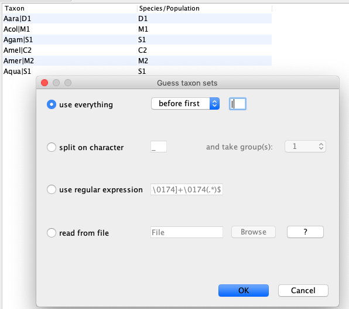

# Background

----

# Programs used in this Exercise

### BEAST2 - Bayesian Evolutionary Analysis Sampling Trees 2

BEAST2 ([http://www.beast2.org](http://www.beast2.org)) is a free software package for Bayesian evolutionary analysis of molecular sequences using MCMC and strictly oriented toward inference using rooted, time-measured phylogenetic trees. This tutorial is written for BEAST v{{ page.beastversion }} .

### BEAUti2 - Bayesian Evolutionary Analysis Utility

BEAUti2 is a graphical user interface tool for generating BEAST2 XML configuration files.

Both BEAST2 and BEAUti2 are Java programs, which means that the exact same code runs on all platforms. For us it simply means that the interface will be the same on all platforms. The screenshots used in this tutorial are taken on a Mac OS X computer; however, both programs will have the same layout and functionality on both Windows and Linux. BEAUti2 is provided as a part of the BEAST2 package so you do not need to install it separately.

### TreeAnnotator

TreeAnnotator is used to summarise the posterior sample of trees to produce a maximum clade credibility tree. It can also be used to summarise and visualise the posterior estimates of other tree parameters (e.g. node height).

TreeAnnotator is provided as a part of the BEAST2 package so you do not need to install it separately.

### Tracer

Tracer ([http://tree.bio.ed.ac.uk/software/tracer](http://tree.bio.ed.ac.uk/software/tracer)) is used to summarise the posterior estimates of the various parameters sampled by the Markov Chain. This program can be used for visual inspection and to assess convergence. It helps to quickly view median estimates and 95% highest posterior density intervals of the parameters, and calculates the effective sample sizes (ESS) of parameters. It can also be used to investigate potential parameter correlations. We will be using Tracer v{{ page.tracerversion }}.

### FigTree

FigTree ([http://tree.bio.ed.ac.uk/software/figtree](http://tree.bio.ed.ac.uk/software/figtree)) is a program for viewing trees and producing publication-quality figures. It can interpret the node-annotations created on the summary trees by TreeAnnotator, allowing the user to display node-based statistics (e.g. posterior probabilities). We will be using FigTree v{{ page.figtreeversion }}.

### R

We will be using [R](\href{https://www.r-project.org) to analyze and plot the output of the AIM analysis

----

# Practical: Inferring species trees and gene flow from multiple loci of 5 anopheles mosquitos using AIM



In this tutorial, we wil infer the species history of 6 different anopheles mosquitos species by using AIM, which is short for *Approximate Isolation with Migration*. AIM is part of the StarBeast2 package. This model can be used when we want to jointly infer the species histories for multiple loci and gene flow between extant and ancestral species.

The aim is to:

-  Learn how to jointly infer the species tree and gene flow of multiple loci from multiple species
-  Get to know how to choose the set-up of such an analysis
-  Learn how to process the output of an AIM analysis

## About the data

The data was previously used to infer the species history of the anopheles gambie complex in . It is comprised of 20 loci, each of a length of about 1000 bp, from the X chromosome of mosquitos from the anopholes Gambia species complex.

## Setting up an analysis in BEAUti

### Download StarBeast2
First, we have to download the packages StarBeast2 and CoupledMCMC by using the BEAUTi package manager. Go to _File >> Manage Packages_ and download the package and CoupledMCMC StarBeast2.

<figure>
	
	
	<figcaption>Figure 1: Download the StarBeast2 package.</figcaption>
</figure>

### Loading the template

Next, we have to load the BEAUTi template from _File_, select _Template >> AIM_.

### Loading the different loci

The sequences for the different loci can be found in the _data_ folder name can be either drag and dropped into BEAUti or imported by _Import Alignment_.
It will ask us what type the data is. If we say nucleotide, it will ask us for each loci individually.
Since all loci are nucleotide data, we can choose _all are nucleotide_. To speed up the setup later, we can press _Link Site Models_ and _Link Clock Models_

### Get species corresponding to the different individuals (Taxon sets)
Next, we have to go to the Taxon sets tab.
To assign the different individuals to different species, press the _Guess_ button. Use everything before first and press the _OK_ button.

<figure>
	
	
	<figcaption>Figure 2: Guess the species of each sampled individual.</figcaption>
</figure>

### Specify the Site Model (Site Model)

Since we Linked all the site models of the different loci together when loading the sequence data, we only have to set up the site models once. We will be using an HKY + &Gamma; 4 model that allows for different relative rates of transversions and transitions, as well as for rate hetereogeneity across different sites.
Additionally, we should make sure that the _estimate_ button for the substitution rates is clicked to allow for rate variation across different loci.
To reduce the number of parameters we have to estimate, we can set frequencies to empirical.
After, we can go back to the _Partitions_ field and press _Unlink Site Models_.
Now each loci will have the same site model, but each with different parameters.

<figure>
	
	
	<figcaption>Figure 3: Set the site model.</figcaption>
</figure>

### Set the clock model (Clock Model)

Since we have all sequences sampled at the present and no calibration, we do not have any information of time to estimate the clock rate.
This means that none of our estimates will be in units of time (e.g. in years), but instead will be in number of substitutions.

### Specify the priors (Priors)

The most important priors to specify here are the priors on the number of active routes of gene flow, the rates of gene flow and the effective population sizes.
An active route of gene flow denotes a route of gene flow between two species that is non zero. The prior on the number of active routes (migIndicatorSum.species) of gene flow is by defaults a Poisson Prior with lambda=0.693.
This puts about 50% of the probability mass on 0 active routes of gene flow. This means that in absence of information about gene flow, a prior probability on having gene flow is fairly low.

In order to speed up the setup, most of the priors are already set to what they should be, expect for the prior on the migration rates.
From a hypothetical previous analysis, we know that our tree has a height of about 0.02 substitutions per site.
If we had a migration rate of 1/0.02=50, this would mean that one lineage of a gene from present to the root is expected to migrate on average 1 time.
The prior on the migration rates is set in the _migRates.Species_ block.
If we set the mean of the log Normal distribution to 25, this assumes that we expect about 1 in every 2 lineages to have one migration event over the course of the whole species tree.
This is not exactly true, but is an ok approximation for the order of magnitude of how many migration events we expect under this prior.

<figure>
	
	
	<figcaption>Figure 4: Setting up the prior on the migration rates.</figcaption>
</figure>

By default, AIM assumes that the migration rate between two co-existing species can not be larger than the inverse time that they co-existed.
This can lead to issues when starting a run, where beast doesn't find a proper state to initialize.
To avoid this (in this example) we have to set the initial migration rates a bit lower, from 1.0 to 0.1.
To do so, you can click `Initial`, next to the migration Rates prior and set the value to 0.1.

<figure>
	
	
	<figcaption>Figure 5: Setting the initial value of the migration rates to 0.1.</figcaption>
</figure>

We can next go to the MCMC tab to specify how long we want the analysis to run for.
In this example, we will increase the Chain Length from 10000000 to 20000000.
Last, we can save the `*.xml` file under _File >> Save as_.

### Run the Analysis using BEAST2

Run the `*.xml` using BEAST2 or use finished runs from the *precooked-runs* folder.
The analysis should take about 20 minutes.

### Analyse the log file using Tracer

First, we can open the `aim.log` file in tracer to check if the MCMC has converged.
If we look at the ESS values, they are below 200 for the posterior and the prior and the analysis should be run for a bit longer.

<figure>
	
	
	<figcaption>Figure 6: Check if the posterior converged.</figcaption>
</figure>

We can additionally check whether tree likelihoods of individual loci, tree heights etc. have converged.
The information about population sizes and migration rates in an AIM log file is not super informative, since it doesn't contain any information about what does parameters correspond to.
This information is instead part of the species.trees file.

### Analyse the species tree distribution in DensiTree

Nex, we can have a look at the distribution of species trees in DensiTree.
To do so, open the files `species.trees` in DensiTree.

<figure>

<figcaption>Figure 6: Distribution of species trees inferred under AIM.</figcaption>
</figure>

What we can see from the looking at the species tree file in densitree, is that the model is pretty certain in resolving most clades.
It is, however, uncertain about how the ancestral species of A. col. and A. gam. attaches to the rest of the tree.
There are overall three possible species trees that model says have somewhat stronger support.

### Summarize the species tree using the AIM species tree annotator

To summarize the species tree, open BEAUTi, go to  _File >> Launch Apps_, select `AIM species tree annotator` and click `launch`.
This will open the AIM species tree annotator.
The AIM species tree annotator summarizes the species trees file.
To do so, it looks for all trees that have the same ranked topology.
For each unique ranked topology, it will then compute its posterior support, as well as the rates of migration and effective populations sizes for each unique ranked topology.
First, we have to choose the input file by clicking `Choose File` next to `Isolation with migration species tree file`.
Then, we have to choose the output file by clocking `Choose File` next to `Output file`.
In order to ensure that the output is saved to the same directory, click on a file and then name the file Anopheles.trees.

<figure>

<figcaption>Figure 9: Setup of the AIM species tree annotator.</figcaption>
</figure>

After, we can click `Analyze`.

This will create a few different files.
`Anopheles.trees` is a tree file that contains all the different unique ranked topologies encountered during the MCMC.
The file `Anopheles.trees.ranked.log` contains a single log file, where the only thing logged is the at which point during the MCMC, the chains was equal to which unique ranked topologies.
Then there are a few additional log files.
`Anopheles.trees.STATE_0_occurances_1724.log` contains all the effective population sizes, migration rates between co-existing species and speciation times for the unique ranked topology number 0 (STATE_0) in the file `Anopheles.trees`.
The number after occurances (here 1724) denotes how often that ranked topology was encountered during the MCMC.
This number will be different for every run.

If we open the file `Anopheles.trees` in icytree.org (or figtree), we can see to which ranked topology each state corresponds to

<figure>

<figcaption>Figure 10: Best supported ranked tree.</figcaption>
</figure>

We can next open the file `Anopheles.trees.STATE_0_occurances_1724.log` in tracer to see the effective population sizes of extant and ancestral species, the (backwards in time) migration rates between co-existing species and the speciation times.

### Plotting the species tree

With the files `Anopheles.trees` and `Anopheles.trees.STATE_0_occurances_1724.log` you can plot the species trees yourselves.
Alternatively, the R script `plotSpeciesTree.R` can help you to do so.
It uses ggplot, ape, phytools and coda that all need to be installed.
We first have to load the species tree function in R using:
`source("../scripts/plotSpeciesTree.R")`
We can next plot the species tree using:
`plotSpeciesTree("Anopheles.trees", "STATE_0_occurances_1724",0.1,0,0,T)`
The `T` (true) at the end will lead to arrows being plotted as forward in time arrows (i.e. migration was from species to species).
If it's `F` (false), then it will plot arrows for backwards in time gene flow.
The value 0.1 denotes the posterior threshold to plot an arrow (i.e. the posterior support for gene flow has to be above that value to be plotted).
The second number is for a Bayes values threshold for Bayes values calculated using the third number as a prior probability for gene flow.

### Some notes of caution

* Different priors, especially on how much and how strong gene flow is expected to occur, can have a large impact on the species tree that is inferred. The reason is that in a IM model, coalescent events on a gene between two species can either be explained by gene flow or by a speciation event.
* Variation in the data that is not accounted for by the model can lead to wrong estimates of the species tree or between which species gene flow occurs.
* Jointly inferring the species tree, gene flow, effective population sizes, gene trees and evolutionary models can take a long time.

----

# Useful Links

- AIM source code: [https://github.com/genomescale/starbeast2](https://github.com/genomescale/starbeast2)
- [Bayesian Evolutionary Analysis with BEAST 2](http://www.beast2.org/book.html) 
- BEAST 2 website and documentation: [http://www.beast2.org/](http://www.beast2.org/)
- Join the BEAST user discussion: [http://groups.google.com/group/beast-users](http://groups.google.com/group/beast-users)

----

# Relevant References


